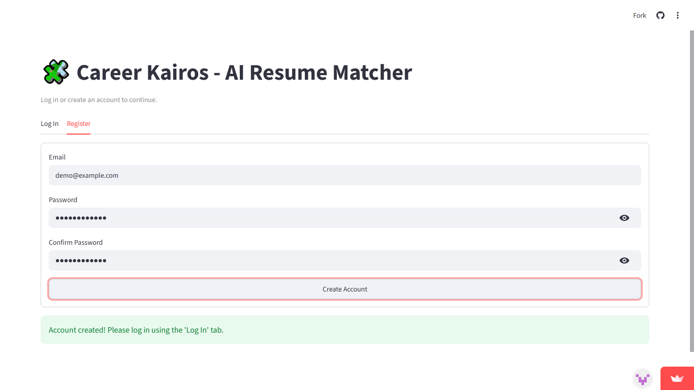
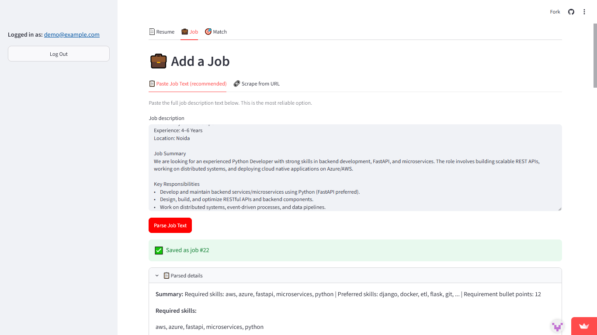
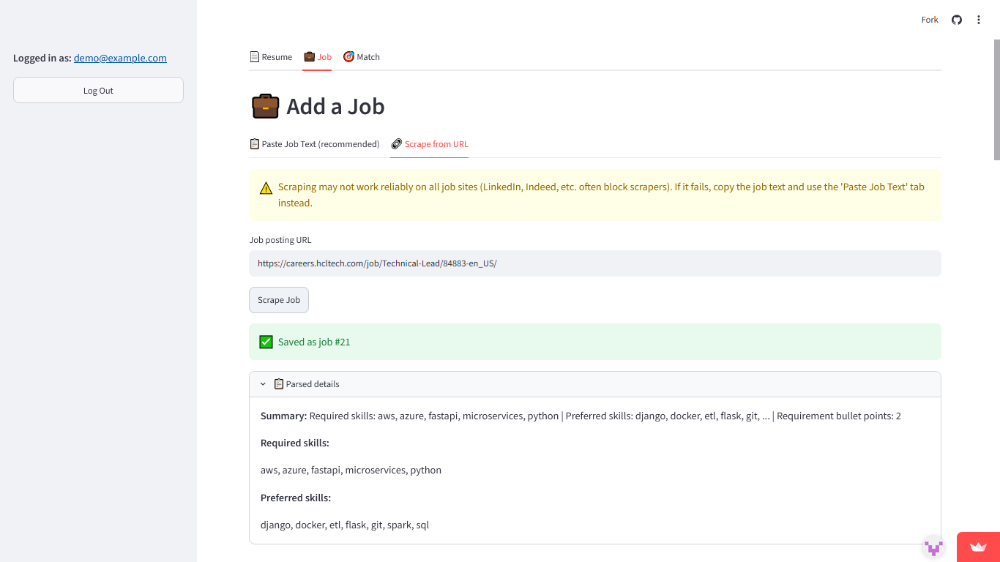
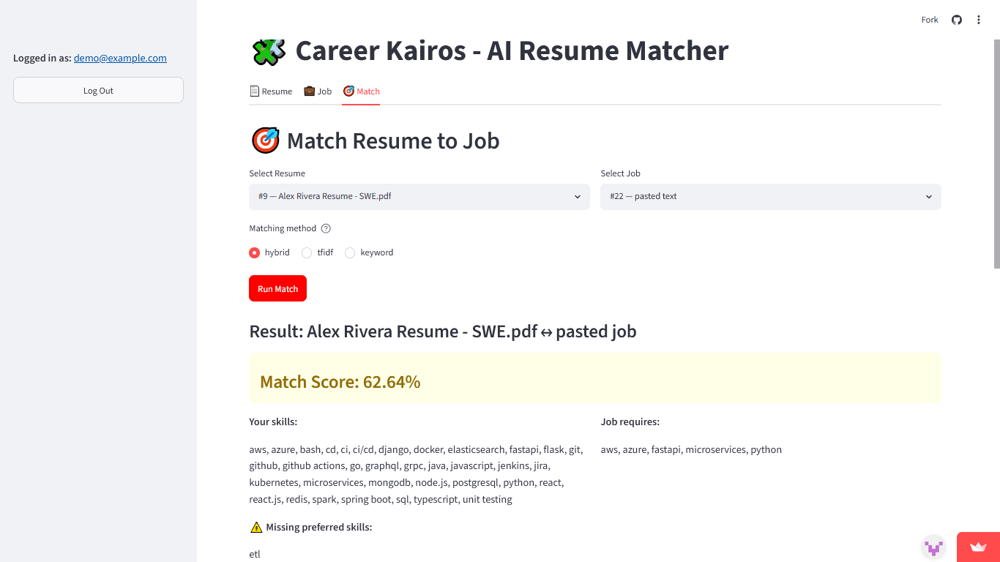
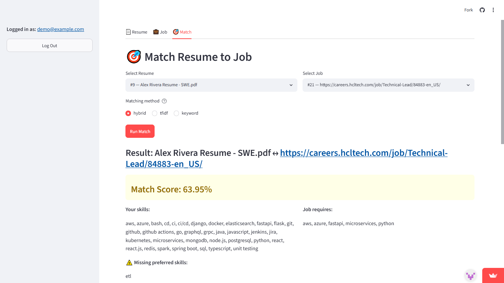

#  Career Kairos — AI Resume Matcher

> An AI-powered tool that compares your resume against a job description, scores the match, and tells you exactly which skills you're missing.

**Live demo:** https://career-kairos.streamlit.app
**Live API docs:** https://career-kairos.onrender.com/docs

> Note: the backend is hosted on a free tier and may take 30-60 seconds to "wake up" if it's been idle. This is normal free-tier behavior, not a bug.

---

## About

I built this to go beyond a typical CRUD app - it combines a real
authentication system, NLP-based resume/job parsing, and a
configurable matching engine (TF-IDF, keyword overlap, or a hybrid
of both) into one working tool, deployed fully live across three
separate free-tier cloud services. The goal was to practice building
something close to a real product: a FastAPI backend with its own
database and auth, talking to a separate frontend over a clean REST
API, the way a real client-server app is structured in production -
and then actually shipping it.

## Screenshots
Below are some representative UI screens from the app.

### Register / Login


### Add job description



### Match results



## Features

-  Email/password authentication with JWT tokens
-  Resume upload (PDF/DOCX) with automatic skill & section extraction
-  Job description input via pasted text (or URL scraping, best-effort)
-  Resume-to-job matching with 3 selectable methods (hybrid, TF-IDF, keyword)
-  Match score, missing required/preferred skills, and tailored recommendations
-  Match history per user

## Tech Stack & Architecture

| Layer       | Technology                                       | Hosted on              |
|-------------|---------------------------------------------------|-------------------------|
| Frontend    | Streamlit                                         | Streamlit Community Cloud |
| Backend     | FastAPI, SQLAlchemy                               | Render (free tier)      |
| Database    | PostgreSQL                                        | Neon (free tier)        |
| NLP/Parsing | spaCy, scikit-learn, pdfminer.six, python-docx    | -                        |
| Auth        | JWT (python-jose), bcrypt password hashing        | -                        |

```
Browser
  │
  ▼
Streamlit Cloud (frontend/app.py)
  │  HTTPS REST calls
  ▼
Render (FastAPI backend)
  │  SQL over SSL
  ▼
Neon (PostgreSQL)
```

## Project Structure

```
resume-matcher/
├── backend/
│   ├── app/
│   │   ├── main.py
│   │   ├── database.py
│   │   ├── models.py
│   │   ├── schemas.py
│   │   ├── auth.py
│   │   ├── routers/          # auth, resume, job, match endpoints
│   │   └── services/         # parser, scraper, matcher logic
│   ├── requirements.txt
│   ├── .python-version       # pins Python 3.12.4 for Render
│   ├── .env.example
│   └── create_tables.py
├── frontend/
│   ├── app.py
│   └── requirements.txt
├── docker-compose.yml         # for local Postgres only
└── start.bat                  # one-click local launcher (Windows)
```

## Running it locally

### Prerequisites
- Python 3.11+ (tested on 3.12.4)
- Docker Desktop (for local PostgreSQL - not needed if you point at Neon instead)

### 1. Clone and configure environment variables

```bash
git clone https://github.com/surendiran-20cl/career-kairos.git
cd career-kairos
copy backend\.env.example backend\.env
```

Open `backend/.env` and fill in real values - either a local Docker
Postgres URL or your own Neon connection string - and generate a
proper `SECRET_KEY`:

```python
import secrets; print(secrets.token_hex(32))
```

### 2. Start the database (skip if using Neon)

```bash
docker-compose up -d
```

### 3. Set up the backend (its own virtual environment)

```bash
cd backend
python -m venv venv
venv\Scripts\activate
pip install -r requirements.txt
python -m spacy download en_core_web_sm
python create_tables.py
uvicorn app.main:app --reload
```

Backend runs at `http://127.0.0.1:8000` (docs at `/docs`).

### 4. Set up the frontend (a *separate* virtual environment)

In a new terminal:

```bash
cd frontend
python -m venv venv
venv\Scripts\activate
pip install -r requirements.txt
streamlit run app.py
```

Frontend opens at `http://localhost:8501`. Update `API_BASE` at the
top of `frontend/app.py` to `http://127.0.0.1:8000` for local
testing (it currently points at the live Render backend).

### Why two separate virtual environments?

Streamlit and this version of FastAPI need different, incompatible
versions of a shared dependency (Starlette). Installing both into
one environment causes one to silently break the other. Keeping
backend and frontend isolated avoids this entirely.

### Shortcut: `start.bat`

Once both venvs are set up once, `start.bat` in the project root
launches the local database, backend, and frontend together, each
in its own terminal window.

## Known Limitations

- **Job URL scraping is best-effort.** It works on some job boards
  but reliably fails on heavily-protected ATS platforms (Workday,
  Oracle, iCIMS, etc.) that block automated scrapers. **Pasting the
  job description text directly** is the reliable path and is the
  default tab in the UI.
- **Skill extraction uses a curated keyword taxonomy**, not a fully
  general NLP model. This means formatting variants of a skill
  (e.g. "PowerBI" vs "Power BI") can sometimes be missed if they
  don't match the taxonomy's exact normalization. Improving this
  normalization is an active area of cleanup.
- **Free-tier cold starts.** The backend (Render) spins down after
  inactivity and can take 30-60 seconds to respond to the first
  request after idling.

## Possible Future Improvements

- Smarter, fuzzy skill-matching (handle spacing/punctuation variants
  and synonyms, not just exact taxonomy hits)
- Headless-browser based scraping (e.g. Playwright) for more
  reliable job URL imports
- Resume improvement suggestions powered by an LLM
- Export match results as a PDF report
- Automated tests (currently none)
- Custom domain instead of the default `*.onrender.com` / `*.streamlit.app` URLs

## License

MIT